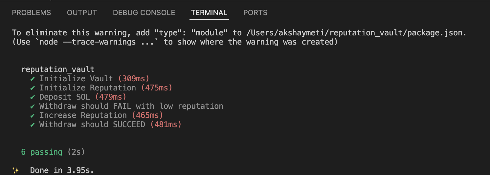

Reputation-Gated Vault 

Overview-

It implements a Reputation-Based Vault using the Anchor framework on Solana.

The vault enforces a dynamic behavior-based withdrawal rule:

Users can only withdraw funds if their on-chain reputation score meets or exceeds a required threshold defined during vault initialization.

✅

[View on Solana Explorer (Devnet)](https://explorer.solana.com/address/2EK5uc9E1RkmKFMZMjhxukDcLFa3Bc4LM57RL38ou2LA?cluster=devnet)

Program Id: 2EK5uc9E1RkmKFMZMjhxukDcLFa3Bc4LM57RL38ou2LA

